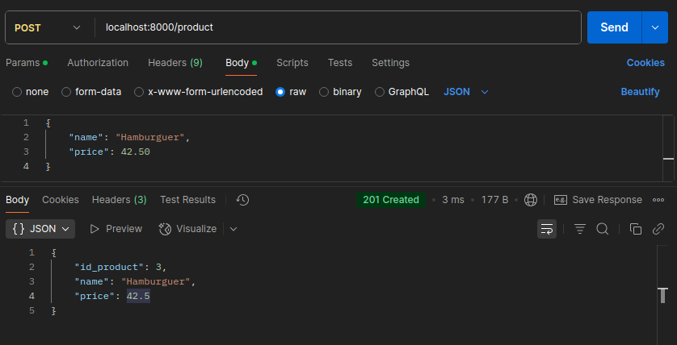
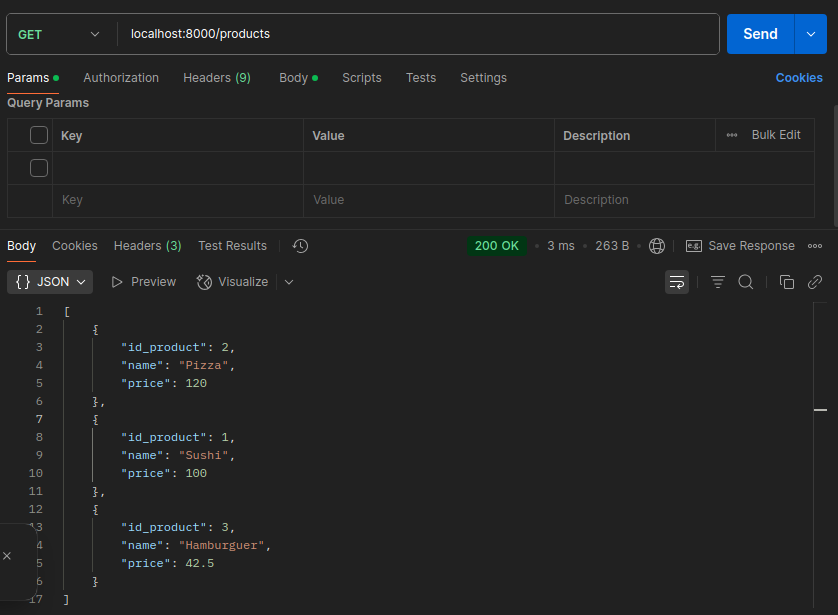
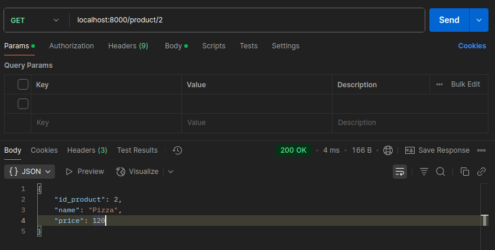

# API REST de Produtos
(Adicionar prints posteriormente)

# Tecnologias utilizadas
- Golang
- Postgres
- Docker

# Arquitetura
A Aplicação roda em container Docker, e o banco de dados roda em outro container
Toda o backend da aplicação foi feito utilizando arquitetura hexagonal

